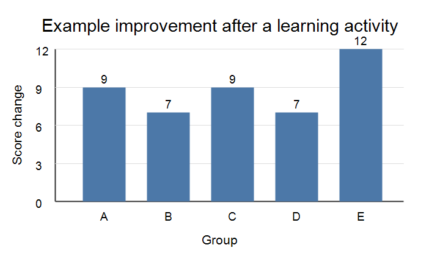

# Introduction

Quarto manuscripts combine ordinary Markdown writing with features that are
useful in scientific and technical documents. The source file remains readable
as plain text, while Quarto can render the same document to HTML, PDF, or Word
[@quarto2026; @pandoc2026].

This example uses a small teaching dataset to show how narrative text, code,
tables, figures, equations, citations, and cross-references can live in one
document. The goal is not to perform a serious analysis; the goal is to show
the workflow.

# Methods {#sec-methods}

Suppose a class measures a simple score before and after a short learning
activity. The observed values are shown in @tbl-observations.

| Group | Baseline score | Follow-up score |
|---|---:|---:|
| A | 62 | 71 |
| B | 67 | 74 |
| C | 59 | 68 |
| D | 73 | 80 |
| E | 65 | 77 |

: Example observations used by the code chunk. {#tbl-observations}

For each group, the change score is defined in @eq-change.

$$
\Delta_i = y_{i,\mathrm{followup}} - y_{i,\mathrm{baseline}}
$$ {#eq-change}

The analysis below shows executable Quarto code syntax. Evaluation is disabled
in the YAML header so the file renders on classroom machines without requiring a
Python/Jupyter setup; set `execute.enabled` and `execute.eval` to `true` after
installing those tools to run the chunks during rendering.

# Results {#sec-results}

The following figure summarizes the change scores from @tbl-observations.

{#fig-change fig-alt="A bar chart showing positive score changes for groups A through E."}

The executable Python chunk below creates the same values shown in
@tbl-observations and computes the change score from @eq-change.

```{python}
#| label: change-score-code

groups = ["A", "B", "C", "D", "E"]
baseline = [62, 67, 59, 73, 65]
follow_up = [71, 74, 68, 80, 77]
change = [after - before for before, after in zip(baseline, follow_up)]
```

The mean change score is computed in the next executable chunk.

```{python}
#| label: lst-mean-change

mean_change = sum(change) / len(change)
print(f"Mean change score: {mean_change:.1f} points")
```

All five groups improved in this small example. The average increase was
8.8 points. When execution is enabled, the chunk above can regenerate the value
from the source data instead of relying on manual copy and paste.

# Discussion

This manuscript demonstrates several Quarto habits that are useful for student
projects:

- Use headings to create a clear document structure.
- Put metadata and output options in the YAML header.
- Label important objects such as @sec-methods, @tbl-observations,
  @eq-change, and @fig-change.
- Keep code and explanation close together so results can be regenerated.
- Cite sources using citation keys such as `[@quarto2026]`.
- Render the same source file to multiple output formats.

For example, the same source file can be rendered with:

```bash
quarto render quarto_section6_example_manuscript.qmd --to html
quarto render quarto_section6_example_manuscript.qmd --to docx
quarto render quarto_section6_example_manuscript.qmd --to pdf
```

# References
