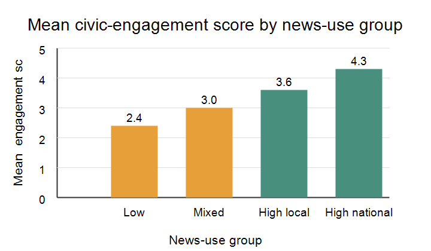

# Introduction

Journalism scholars often ask how news exposure shapes what people know, what
issues they consider important, and whether they participate in civic life.
Classic agenda-setting research argues that news coverage can influence which
public issues become salient to audiences [@mccombs1972]. Framing research
adds that news stories also shape interpretation by emphasizing some aspects of
an issue over others [@entman1993].

This teaching manuscript uses a fictional survey to ask a simple question:
are students who report higher news use also more civically engaged? The
example is intentionally small so that students can focus on the logic of a
social science manuscript and the Quarto features used to write one.

# Theory and Expectations

News use may support civic engagement by increasing issue awareness, providing
practical information about public affairs, and making political participation
feel more relevant. Prior research on media effects also shows that the
relationship between news and participation depends on message content,
audience motivation, and social context [@iyengar1991; @scheufele1999].

This example paper uses one research question and one hypothesis:

**RQ1:** How does average civic engagement vary across news-use groups?

**H1:** Students in higher news-use groups will report higher civic-engagement
scores than students in lower news-use groups.

# Methods {#sec-methods}

The fictional dataset contains 12 observations. Each row represents one survey
respondent. News use is grouped into four categories, and civic engagement is
measured on a 1 to 5 scale, where higher values indicate greater self-reported
engagement.

| ID | News-use group | Civic-engagement score |
|---:|---|---:|
| 1 | Low | 2.1 |
| 2 | Low | 2.5 |
| 3 | Low | 2.6 |
| 4 | Mixed | 2.8 |
| 5 | Mixed | 3.0 |
| 6 | Mixed | 3.2 |
| 7 | High local | 3.4 |
| 8 | High local | 3.6 |
| 9 | High local | 3.8 |
| 10 | High national | 4.1 |
| 11 | High national | 4.2 |
| 12 | High national | 4.6 |

: Fictional survey data for a communication research example. {#tbl-survey}

The mean civic-engagement score for each group is calculated using @eq-mean.

$$
\bar{y}_g = \frac{1}{n_g}\sum_{i=1}^{n_g} y_{ig}
$$ {#eq-mean}

In @eq-mean, $\bar{y}_g$ is the mean engagement score for group $g$, $n_g$ is
the number of respondents in that group, and $y_{ig}$ is respondent $i$'s
engagement score.

# Results {#sec-results}

@fig-engagement summarizes the group means from @tbl-survey.

{#fig-engagement fig-alt="A bar chart showing higher mean civic-engagement scores for higher news-use groups."}

The following Python chunk shows how the group means could be generated from
the same values listed in @tbl-survey. Execution is disabled in the YAML header
so the manuscript renders without requiring Python or Jupyter. To run the code
during rendering, set `execute.enabled` and `execute.eval` to `true`.

```{python}
#| label: news-use-means

survey = [
    ("Low", 2.1), ("Low", 2.5), ("Low", 2.6),
    ("Mixed", 2.8), ("Mixed", 3.0), ("Mixed", 3.2),
    ("High local", 3.4), ("High local", 3.6), ("High local", 3.8),
    ("High national", 4.1), ("High national", 4.2), ("High national", 4.6),
]

groups = {}
for news_group, score in survey:
    groups.setdefault(news_group, []).append(score)

for news_group, scores in groups.items():
    mean_score = sum(scores) / len(scores)
    print(f"{news_group}: {mean_score:.1f}")
```

The pattern is consistent with H1. The low news-use group has the lowest mean
engagement score, while the high national news-use group has the highest mean
score. Because this is a fictional teaching dataset, the result should be read
as an example of manuscript structure rather than as evidence about actual
student behavior.

# Discussion

This example follows a common social science paper structure:

- The introduction motivates a communication problem.
- The theory section connects the question to prior literature.
- The methods section defines the sample, variables, and calculation.
- The results section reports a table, a figure, and an interpretable pattern.
- The discussion explains the meaning and limits of the result.

For journalism and communication courses, this format is useful because it
separates conceptual claims from empirical evidence. Students can revise the
theory, replace the fictional data with their own survey or content-analysis
data, and render the same Quarto source to HTML, PDF, or Word.

# References
